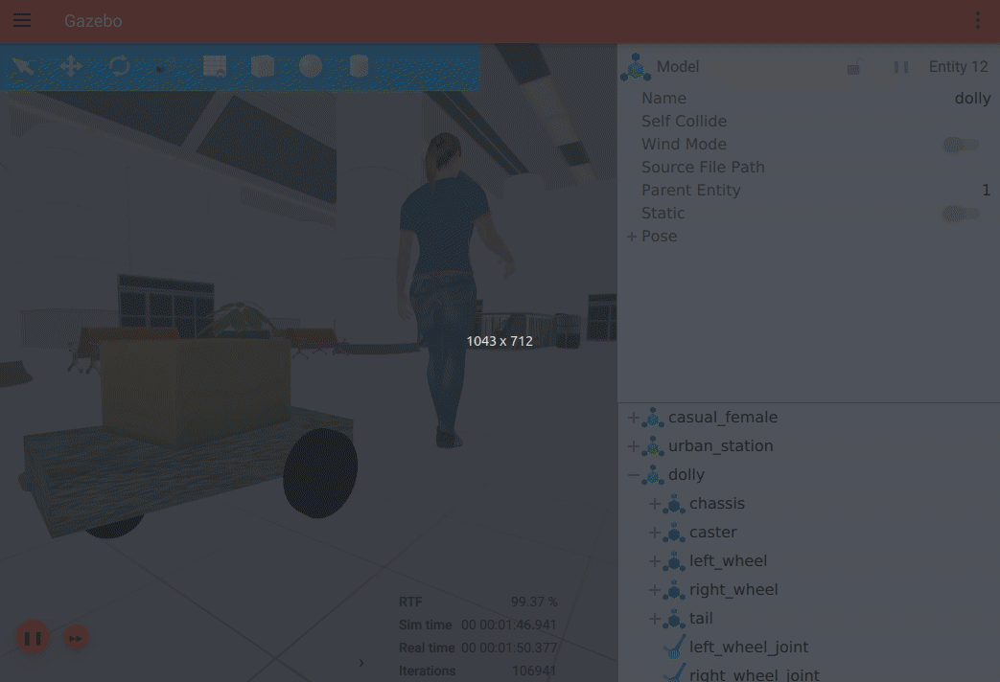

# Dolly the robot

_It's a sheep, it's a dolly, it's a following robot. Born to be cloned._

Packages for launching Dolly demo, which uses ROS 2 and either
[Gazebo](https://gazebosim.org) or [Ignition](https://ignitionrobotics.org).

Gazebo | Ignition
-- | --
 | 

## Versions

Dolly is known to work on the following systems.

Branch | ROS | Gazebo-classic | Ignition | OS
-- | -- | -- | -- | --
[crystal](https://github.com/chapulina/dolly/tree/crystal) | Crystal | Gazebo 9 | :x: | Ubuntu Bionic
[dashing](https://github.com/chapulina/dolly/tree/dashing) | Dashing | Gazebo 9 | :x: | Ubuntu Bionic, macOS Sierra
[eloquent](https://github.com/chapulina/dolly/tree/eloquent) | Eloquent | Gazebo 9, Gazebo 11 | Citadel | Ubuntu Bionic
[foxy](https://github.com/chapulina/dolly/tree/foxy) | Foxy | Gazebo 11 | Citadel | Ubuntu Focal
[galactic](https://github.com/chapulina/dolly/tree/galactic) | Galactic, Rolling | Gazebo 11 | Edifice | Ubuntu Focal

## Packages

This repository contains the following packages:

* `dolly`: Metapackage which provides all other packages.
* `dolly_follow`: Provides node with follow logic.
* `dolly_gazebo`: Robot model, simulation world and launch scripts for Gazebo-classic.
* `dolly_ignition`: Robot model, simulation world and launch scripts for Ignition.

## Install

It's encouraged that you build Dolly from source, to learn about how to
develop your own packages. But in case you just want to give it a quick
try, there are binaries available too.

### From binaries

Dolly has been released into several ROS distros. These are the currently
supported ones:

| ROS      | Packages                       |
|----------|--------------------------------|
| Foxy     | `ros-foxy-dolly`               |
|          | `ros-foxy-dolly-follow`        |
|          | `ros-foxy-dolly-gazebo`        |
|          | `ros-foxy-dolly-ignition `     |
| Galactic | `ros-galactic-dolly`           |
|          | `ros-galactic-dolly-follow`    |
|          | `ros-galactic-dolly-gazebo`    |
|          | `ros-galactic-dolly-ignition ` |
| Rolling  | `ros-rolling-dolly`            |
|          | `ros-rolling-dolly-follow`     |
|          | `ros-rolling-dolly-gazebo`     |
|          | `ros-rolling-dolly-ignition `  |

### From source

Install instructions for Ubuntu Bionic.

1. Install at least one simulator,
   [Gazebo](http://gazebosim.org/tutorials?cat=install) or
   [Ignition](https://ignitionrobotics.org/docs/edifice/install)

1. Install the appropriate ROS 2 version as instructed
   [here](https://index.ros.org/doc/ros2/Installation/Linux-Install-Debians/).

1. Clone Dolly, choose the branch according to your ROS distro:

        mkdir -p ~/ws/src
        cd ~/ws/src
        git clone https://github.com/chapulina/dolly -b <distro>

1. Install dependencies:

        cd ~/ws
        rosdep install --from-paths src --ignore-src -r -y

1. Build and install:

        cd ~/ws
        colcon build

## Run

### Gazebo-classic

If you had Gazebo installed when compiling Dolly's packages, Gazebo support
should be enabled.

1. Setup environment variables (the order is important):

        . /usr/share/gazebo/setup.sh
        . ~/ws/install/setup.bash

    > *Tip*: If the command `ros2 pkg list | grep dolly_gazebo` comes up empty
      after setting up the environment, Gazebo support wasn't correctly setup.

1. Launch Dolly in a city (this will take some time to download models):

        ros2 launch dolly_gazebo dolly.launch.py world:=dolly_city.world

1. Launch Dolly in an empty world:

        ros2 launch dolly_gazebo dolly.launch.py world:=dolly_empty.world

### Ignition

1. Setup environment variables:

        . ~/ws/install/setup.bash

    > *Tip*: If the command `ros2 pkg list | grep dolly_ignition` comes up empty
      after setting up the environment, Ignition support wasn't correctly setup.

1. Launch Dolly in a station:

        ros2 launch dolly_ignition dolly.launch.py

## Featured

* QConSF 2018
    * 🎥 [Open Source Robotics: Hands on with Gazebo and ROS 2](https://www.youtube.com/watch?v=Gwbk6Qf_TqY)
    * ⌨️ [Source code](https://github.com/chapulina/simslides/tree/QConSF_Nov2018)
* InfoQ
    * 📰 [Open Source Robotics: Getting Started with Gazebo and ROS 2](https://www.infoq.com/articles/ros-2-gazebo-tutorial/)
* ROS Developers Live Class
    * 🎥 [#70 How to Control a Robot with ROS2 (Dashing)](https://www.youtube.com/watch?v=qB4SaP3TZog)
    * 🎥 [#71 How to visualize sensor data in ROS2](https://www.youtube.com/watch?v=s3fBGSpmER0)
* ROSConJP 2019
    * 🎥 [これからのGazebo: ROSのシミュレーションの次世代](https://vimeo.com/370247782)
    * ⌨️ [Source code](https://github.com/chapulina/rosconjp_2019)
* ROS Developers Day 2020
    * 🎥 [Hands-on with Ignition and ROS2](https://youtu.be/nLp4uzN5NMs?t=622)
